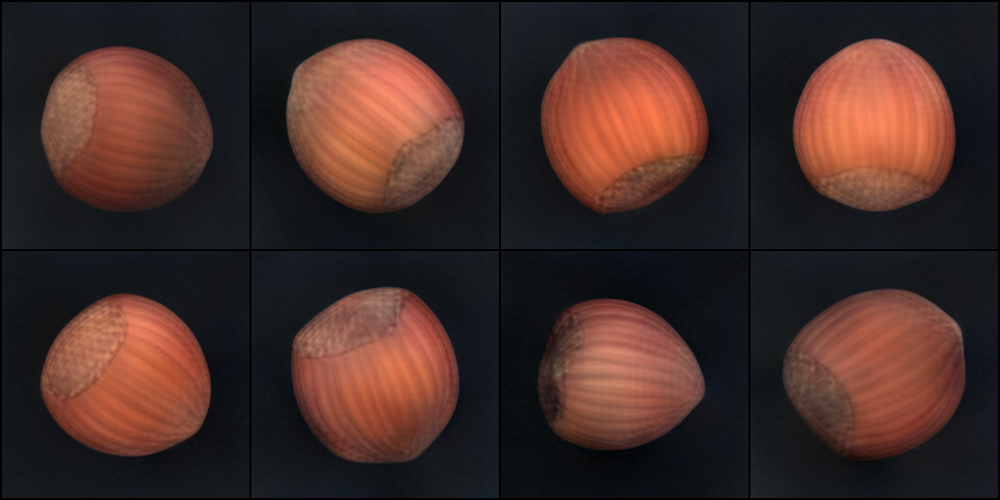
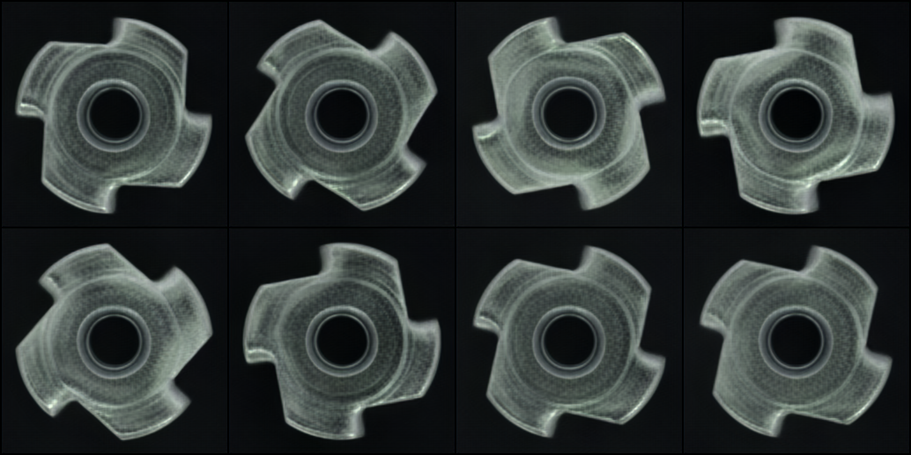
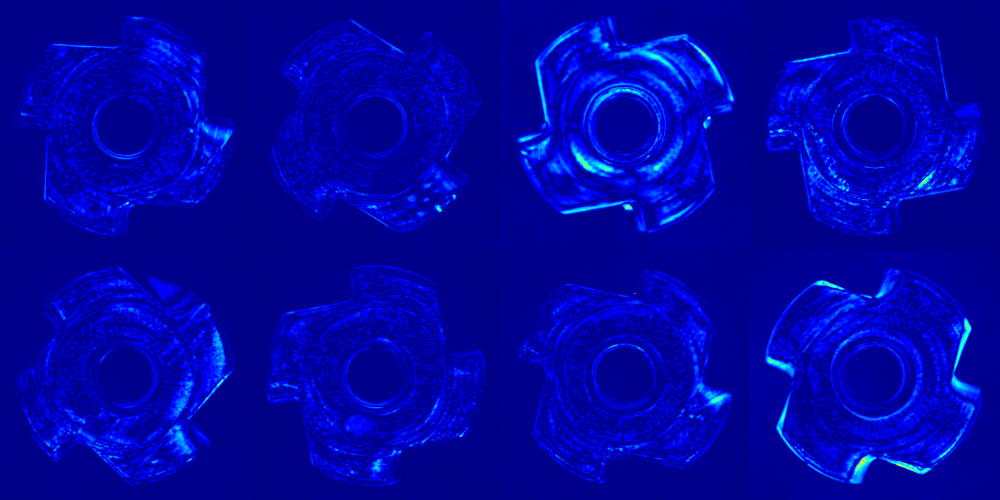
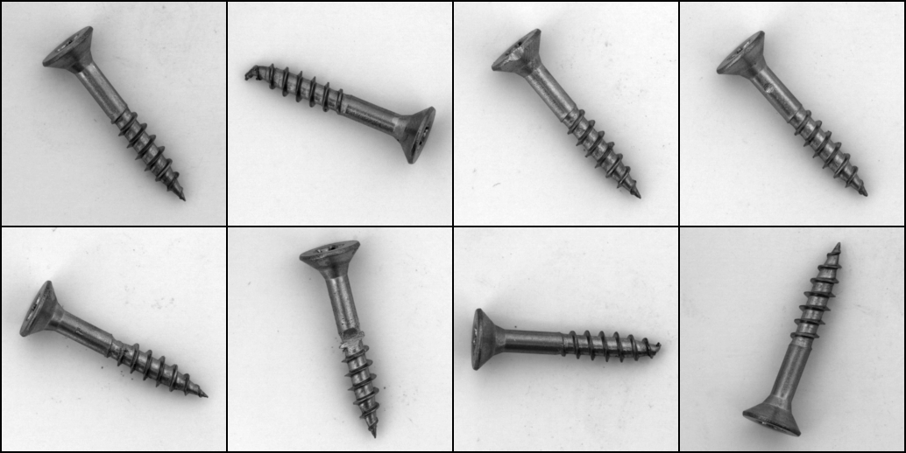
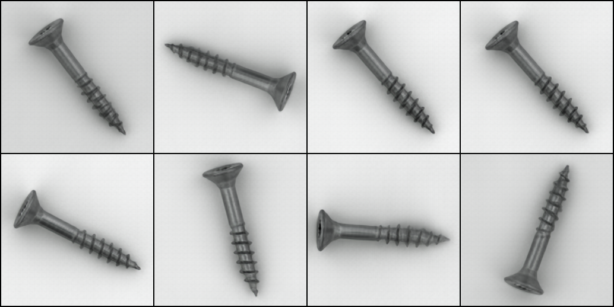
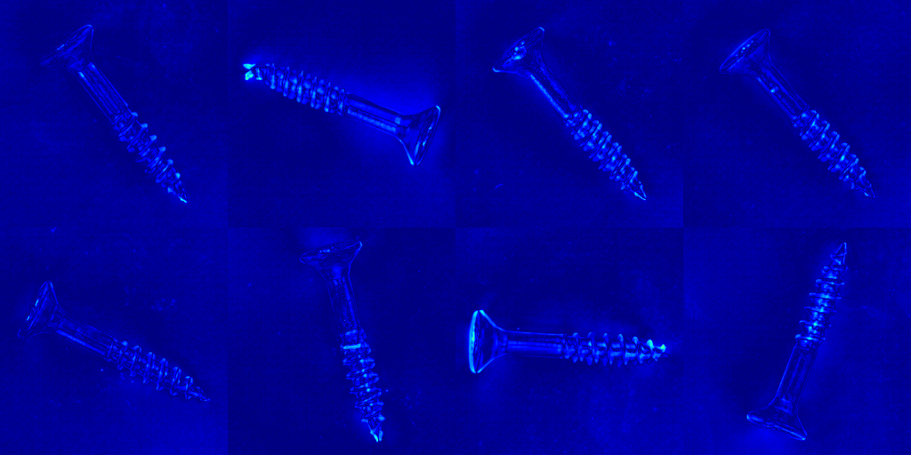

# Anomaly Detection with Adversarial Autoencoders

This project performs unsupervised anomaly detection on the MVTec AD dataset using Adversarial Autoencoders (AAEs). It features a modular PyTorch Lightning pipeline, multi-loss reconstruction and logging via MLflow.

## Features

- Modular AAE: Encoder, Decoder, Discriminator
- Reconstruction losses: MSE, SSIM, Perceptual, Edge, Color, Texture
- Optional adaptive thresholding (Otsu, percentile)
- MLflow logging: hyperparameters, metrics, visuals
- Manual optimization with encoder scheduler
- DevContainer support for reproducible environments

## Structure

```
.
├── .devcontainer/          # VSCode DevContainer setup
├── ano_det.ipynb
├── backbones               # Backbone architecture for Encoder
├── checkpoints             # Model checkpoints
├── data                    # MVTec data
├── logger                  # MLflow logger setup
├── main.py
├── mlruns                  # MLflow logs and checkpoints
├── modeling                # Encoder, Decoder, Discriminator, LightningModule
├── README.md
├── requirements.txt
├── src                     # Dataset, LightningDataModule, Train, Test, Infer, Loss
└── utils                   # Metrics, visualization, thresholding
```

## Quickstart

Use the notebook ```ano_det.ipynb``` or run the main script with different modes and parameters via command line arguments.

### Training

Fresh training start.
```bash
python main.py --mode train --class_name bottle --epochs 100
```

Resume training from checkpoints.
```bash
python main.py --mode train --class_name bottle --epochs 100 --checkpoint checkpoints/conv_bottle.ckpt
```

### Testing

```bash
python main.py --mode test --checkpoint checkpoints/conv_bottle.ckpt
```

### Inference

```bash
python main.py --mode infer --checkpoint checkpoints/conv_bottle.ckpt
```

## Results

During testing, error maps can be thresholded using Otsu’s method or a percentile. Metrics such as pixel-level AUROC, AUPRC, F1-score, and IoU are computed against ground-truth masks. 
From the configurations in ```ano_det.ipynb``` sample visualization output without threshold inludes:

| Class    | Input                             | Reconstruction                     | Heatmap                          |
|----------|-----------------------------------|------------------------------------|----------------------------------|
| Hazelnut |  |   | |
| Metal Nut| |  | |
| Screw    |      |      | |

Note: Adjust reconstruction loss weights and training time for better results.

## MLFlow UI

Access logging via command line argument.

```bash
mlflow ui --backend-store-uri file:./mlruns
```